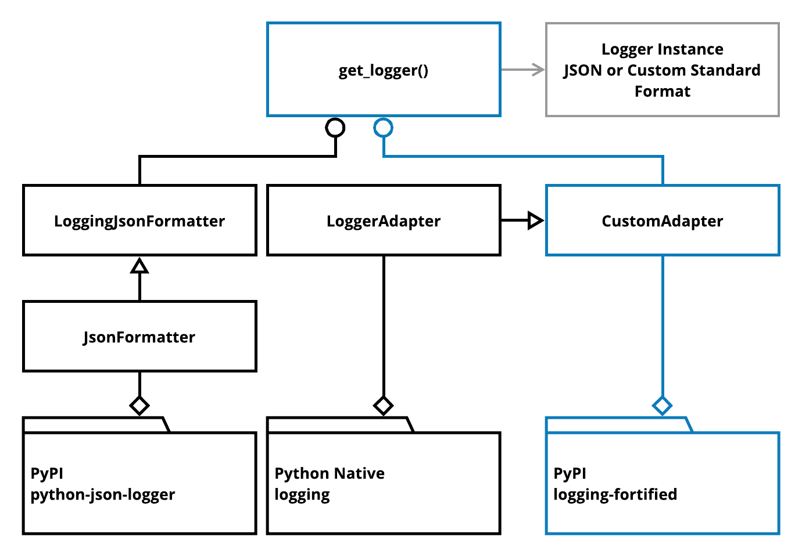

.. -*- mode: rst -*-
####################################
logging-fortified
####################################

This Python project is an extension of the native Python component `logging <https://docs.python.org/3/library/logging.html>`_
providing more robust message formatting for standard and JSON logging output, and in addtion allowing for extra
content populated as dictionaries.

Important Note
------------------------------------
This Python project is a refactoring of `logging_mv_integrations <https://pypi.org/project/logging-mv-integrations/>`_
for the purpose of general usage intent.

Work In Progress
------------------------------------
The following still needs to be performed for this Python project:

- Unit-testing: This project will be switching over to using Python native Unit testing framework `unittest <https://docs.python.org/3/library/unittest.html>`_.
- More concise documentation is required.
- Travis CI

************************************
Badges
************************************

.. start-badges

.. list-table::
    :stub-columns: 1

    * - info
        |license|
    * - tests
      - |travis|
    * - package
      - |version| |supported-versions|

.. |license| image:: https://img.shields.io/badge/License-MIT-yellow.svg
    :alt: License Status
    :target: https://opensource.org/licenses/MIT

.. |version| image:: https://img.shields.io/pypi/v/logging_fortified.svg?style=flat
    :alt: PyPI Package latest release
    :target: https://pypi.python.org/pypi/logging_fortified

.. |supported-versions| image:: https://img.shields.io/pypi/pyversions/logging-fortified.svg?style=flat
    :alt: Supported versions
    :target: https://pypi.python.org/pypi/logging-fortified

.. end-badges

************************************
Install
************************************

.. code-block:: bash

    pip install logging_fortified

************************************
Architecture
************************************

``logging-fortified`` is an extension of the `logging facility for Python <https://docs.python.org/3/library/logging.html>`_
used for providing custom logger levels, format, and output.

Function: get_logger()
====================================

.. code-block:: python

    def get_logger(
        logger_name,
        logger_version=None,
        logger_level=logging.INFO,
        logger_format=LoggingFormat.JSON,
        logger_output=LoggingOutput.STDOUT_COLOR,
        logger_handler=None
    ):

get_logger(): Parameters
------------------------------------

+-----------------+-------------------------------------------------------------------------------------------------------------------------+
| Parameter       | Purpose                                                                                                                 |
+=================+=========================================================================================================================+
| logger_name     | Return a logger with the specified name or, if name is None, return a logger which is the root logger of the hierarchy. |
+-----------------+-------------------------------------------------------------------------------------------------------------------------+
| logger_version  |                                                                                                                         |
+-----------------+-------------------------------------------------------------------------------------------------------------------------+
| logger_format   | LoggingFormat                                                                                                           |
+-----------------+-------------------------------------------------------------------------------------------------------------------------+
| logger_output   | LoggingOutput                                                                                                           |
+-----------------+-------------------------------------------------------------------------------------------------------------------------+
| logger_handler  | logging.StreamHandler() or logging.FileHandler()                                                                        |
+-----------------+-------------------------------------------------------------------------------------------------------------------------+

Logging Levels
------------------------------------

Same Python logging levels, including one additional level NOTE.

+------------+------------------------------------------------------------------------------------------------------------------------------------------------+
| Level      | Purpose                                                                                                                                        |
+============+================================================================================================================================================+
| DEBUG      | Detailed information, typically of interest only when diagnosing problems.                                                                     |
+------------+------------------------------------------------------------------------------------------------------------------------------------------------+
| NOTE       | Detailed information, request processing, for example, request using cURL.                                                                     |
+------------+------------------------------------------------------------------------------------------------------------------------------------------------+
| INFO       | Confirmation that things are working as expected.  *[DEFAULT]*                                                                                 |
+------------+------------------------------------------------------------------------------------------------------------------------------------------------+
| WARNING    | An indication that something unexpected happened, or indicative of some problem in the near future. The software is still working as expected. |
+------------+------------------------------------------------------------------------------------------------------------------------------------------------+
| ERROR      | Due to a more serious problem, the software has not been able to perform some function.                                                        |
+------------+------------------------------------------------------------------------------------------------------------------------------------------------+
| CRITICAL   | A serious error, indicating that the program itself may be unable to continue running.                                                         |
+------------+------------------------------------------------------------------------------------------------------------------------------------------------+

Logging Format
------------------------------------

+------------+-------------------------------------------------------------------------------------------------------+
| Format     | Purpose                                                                                               |
+============+=======================================================================================================+
| STANDARD   | Standard logging format.                                                                              |
+------------+-------------------------------------------------------------------------------------------------------+
| JSON       | JSON logging format.  *[DEFAULT]*                                                                     |
+------------+-------------------------------------------------------------------------------------------------------+

.. code-block:: python

    class LoggingFormat(object):
        """Logging Format ENUM
        """
        STANDARD = "standard"
        JSON = "json"

Logging Output
------------------------------------

+--------------+----------------------------------------------------------------------------------------------+
| Output       | Purpose                                                                                      |
+==============+==============================================================================================+
| STDOUT       | Standard Output to terminal                                                                  |
+--------------+----------------------------------------------------------------------------------------------+
| STDOUT_COLOR | Standard Output using colored terminal                                                       |
+--------------+----------------------------------------------------------------------------------------------+
| FILE         | Standard Output to file created within *./tmp/log_<epoch time seconds>.json*.                |
+--------------+----------------------------------------------------------------------------------------------+

.. code-block:: python

    class LoggingOutput(object):
        """Logging Output ENUM
        """
        STDOUT = "stdout"
        STDOUT_COLOR = "color"
        FILE = "file"

Logging JSON Format
------------------------------------

.. code-block:: python

    import logging
    from logging_fortified import (LoggingFormat, get_logger, __version__)

    log = get_logger(
        logger_name=__name__,
        logger_version=__version__,
        logger_format=LoggingFormat.JSON,
        logger_level=logging.NOTE
    )

    log.info("logging: info", extra={'test': __name__})
    log.note("logging: note", extra={'test': __name__})
    log.debug("logging: debug", extra={'test': __name__})
    log.warning("logging: warning", extra={'test': __name__})
    log.error("logging: error", extra={'test': __name__})
    log.critical("logging: critical", extra={'test': __name__})
    log.exception("logging: exception", extra={'test': __name__})

Logging JSON Example Output
------------------------------------

.. code-block:: bash

    $ make run-examples

    {"asctime": "2018-05-11 05:41:39 -0700", "levelname": "INFO", "name": "__main__", "version": "0.1.0", "message": "logging: info", "test": "__main__"}
    {"asctime": "2018-05-11 05:41:39 -0700", "levelname": "NOTE", "name": "__main__", "version": "0.1.0", "message": "logging: note", "test": "__main__"}
    {"asctime": "2018-05-11 05:41:39 -0700", "levelname": "WARNING", "name": "__main__", "version": "0.1.0", "message": "logging: warning", "test": "__main__"}
    {"asctime": "2018-05-11 05:41:39 -0700", "levelname": "ERROR", "name": "__main__", "version": "0.1.0", "message": "logging: error", "test": "__main__"}
    {"asctime": "2018-05-11 05:41:39 -0700", "levelname": "CRITICAL", "name": "__main__", "version": "0.1.0", "message": "logging: critical", "test": "__main__"}
    {"asctime": "2018-05-11 05:41:39 -0700", "levelname": "ERROR", "name": "__main__", "version": "0.1.0", "message": "logging: exception", "exc_info": "NoneType: None", "test": "__main__"}

    [
        {
            'asctime': '2018-05-11 05:41:39 -0700',
            'levelname': 'INFO',
            'message': 'logging: info',
            'name': '__main__',
            'test': '__main__',
            'version': '0.1.0',
        },
        {
            'asctime': '2018-05-11 05:41:39 -0700',
            'levelname': 'NOTE',
            'message': 'logging: note',
            'name': '__main__',
            'test': '__main__',
            'version': '0.1.0',
        },
        {
            'asctime': '2018-05-11 05:41:39 -0700',
            'levelname': 'WARNING',
            'message': 'logging: warning',
            'name': '__main__',
            'test': '__main__',
            'version': '0.1.0',
        },
        {
            'asctime': '2018-05-11 05:41:39 -0700',
            'levelname': 'ERROR',
            'message': 'logging: error',
            'name': '__main__',
            'test': '__main__',
            'version': '0.1.0',
        },
        {
            'asctime': '2018-05-11 05:41:39 -0700',
            'levelname': 'CRITICAL',
            'message': 'logging: critical',
            'name': '__main__',
            'test': '__main__',
            'version': '0.1.0',
        },
        {
            'asctime': '2018-05-11 05:41:39 -0700',
            'exc_info': 'NoneType: None',
            'levelname': 'ERROR',
            'message': 'logging: exception',
            'name': '__main__',
            'test': '__main__',
            'version': '0.1.0',
        },
    ]

******************************
Requirements
******************************

``logging-fortified`` module is built upon Python 3 and has dependencies upon
several Python modules available within `Python Package Index PyPI <https://pypi.python.org/pypi>`_.

.. code-block:: bash

    make install-requirements

or

.. code-block:: bash

    python3 -m pip uninstall --yes --no-input -r requirements.txt
    python3 -m pip install --upgrade -r requirements.txt

Dependencies
===========================

- coloredlogs: https://pypi.python.org/pypi/coloredlogs
- pprintpp: https://pypi.python.org/pypi/pprintpp
- python-json-logger: https://pypi.python.org/pypi/python-json-logger
- Pygments: https://pypi.python.org/pypi/Pygments
- safe-cast: https://pypi.python.org/pypi/safe-cast
- wheel: https://pypi.python.org/pypi/wheel
